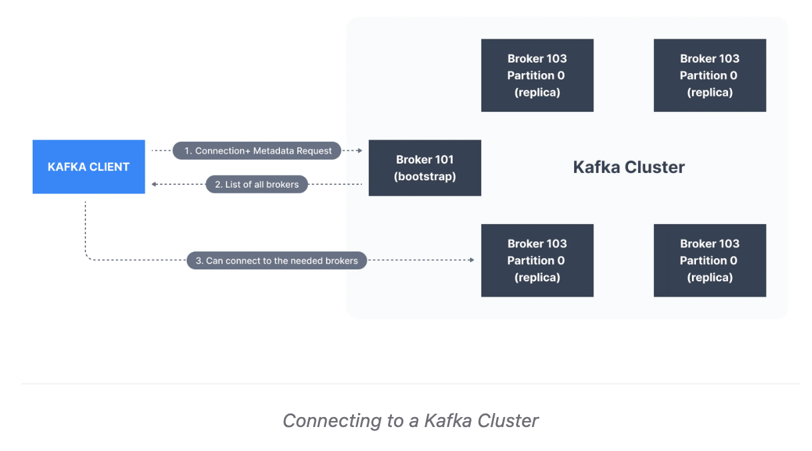
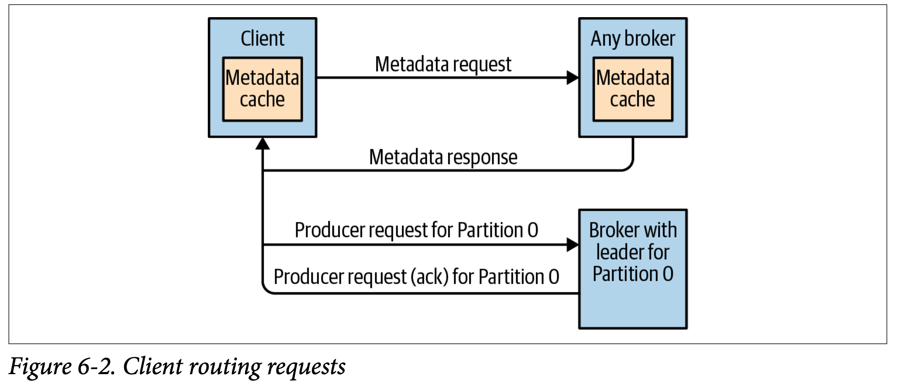

# Apache_Kafka_Understanding
This project guide us for apache kafka


### Request flow for message

### 
    -->Kafka Client -> Connect to any of the broker mentioned in (broker list of kafka client app), since all broker are in sync and have all the information about the topic/partitions
    -> Particular broker get details of topic and partions related to it. -> leader partition is selected for that topic and list of leader partions is fetch back, client select the leader partion on which that message should go -> leader partion replicate the message into partion replica -> consumer consume the message  for nearest in sync replica
    -> next time, client remember the broker who has the topic and details  of partions



* If a broker receives a produce request for a specific partition and the leader for this partition is on a different broker, 
  * the client that sent the produce request will get an error response of “Not a Leader for Partition.” The same error will occur if a
  * fetch request for a specific partition arrives at a broker that does not have the leader for that partition.
  * Produce request : request which has the message body from client
  * Fetch request : request send by various replica's of leader partitions to get the recent message
    * ```Kafka’s clients are responsible for sending produce and fetch requests to the broker that contains the leader for the relevant partition for the request```
* **How do the clients know where to send the requests?**
  * Kafka clients use another request type called a **_metadata request_**, which includes a **_list of topics the client is interested in_**
    * server response specifies which **partitions exist in the topics, the replicas for each partition, and which replica is the leader**
    * Metadata requests can be sent to any broker.
    * Clients typically cache this information and use it to direct produce and fetch requests to the correct broker for each partition
    * occasionally refresh this information
    * **Note : if a client receives the “Not a Leader” error to one of its requests, it will refresh its metadata before trying to send the request again, since the error indicates that the client is using outdated infor‐ mation and is sending requests to the wrong broker**

  * Produce Request :
    * broker that contains the lead replica for a partition receives a produce request for this partition
    * broker will write the new messages to local disk. On Linux, the messages are written to the filesystem cache
    * leader observes that the follower replicas replicated the message, at which point a response is sent to the client.
  * Fetch Request :
    * client sends a request, asking the broker to send messages from a list of topics, partitions, and offsets
    * Clients also specify a limit to how much data the broker can return for each partition
      * Without this limit, brokers could send back replies large enough to cause clients to run out of memory
    * When the leader receives the request, it first checks if the request is valid
      * If offset is deleted or not exist, respond with error to client
      * If valid : the broker will read messages from the partition, up to the limit set by the client in the request, and send the messages to the client
    * clients can also define a timeout to tell the broker , If you didn’t satisfy the minimum amount of data to send within x milli‐ seconds, just send what you got.
    * How to check if consumer only consume messages from replica's ?
  * 
