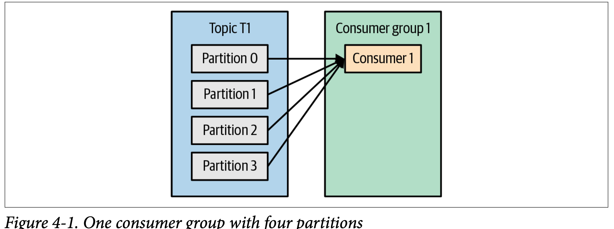

# Kafka Consumer in details
* **Consumer & Consumer group**
    * each consumer in the group will receive messages from a different subset of the partitions in the topic
    * * 
    * As above figure depict, below points
        * There is one consumer group, which have only one consumer inside the group
        * And Topic has four partition , since there is only one consumer , that same instance is consuming messages from all the partition.
        * We can have at max number of consumer as number of partition. Excess consumer will not be use while reading message.
    * We can have multiple consumer group subscribe to same topic.
        * You can consider the consumer group as logical use case to process the message.
        * For example : Payment event message, this can be use in two different way
            * Payment notification to user : this is one of consumer group, subscribe to same topic
            * Payment process via bank : this is another consumer group, subscribe to same topic
* **Consumer Groups and Partition Rebalance**
    * When we add a new consumer to the group, it starts consuming messages from partitions previously consumed by another consumer
    * When a consumer shuts down or crashes; it leaves the group, and the partitions it used to consume will be consumed by one of the remaining consumers
    * Reassignment of partitions to consumers also happens when the topics the consumer group is consuming are modified (e.g., if an administrator adds new partitions).
    * **Rebalance :**
      * Eager rebalances : all consumers stop consuming, give up their owner‐ ship of all partitions, rejoin the consumer group
      * Cooperative rebalances : 
        * typically involve reas‐ signing only a small subset of the partitions from one consumer to another, and allowing consumers to continue processing records from all the partitions that are not reassigned
        * Initially, the consumer group leader informs all the consumers that they will lose ownership of a subset of their partitions, then the consumers stop consuming from these partitions and give up their ownership in them. In the second phase, the consumer group leader assigns these now orphaned partitions to their new owners
    * **Consumer liveliness :**
      * Consumers maintain membership in a consumer group and ownership of the parti‐ tions assigned to them by sending heartbeats to a Kafka broker designated as the group coordinator 
      * this broker can be different for different consumer group
      * if consumer stops sending heartbeats for long enough, its session will timeout and the group coordinator will consider it dead and trigger a rebalance
      * the consumer will notify the group coordinator that it is leaving, and the group coordinator will trigger a rebalance immediately
      * The first consumer to join the group becomes the group leader
    *** How Does the Process of Assigning Partitions to Consumers Work?**
        * The first consumer to join the group becomes the group leader
        * The leader receives a list of all consumers in the group from the group coordinator
        * group leader is responsible for assigning a subset of partitions to each consumer
        * After deciding on the partition assignment, the consumer group leader sends the list of assignments to the group co-ordinator(broker)
          * which sends this information to all the consumers
        * Each consumer only sees its own assignment—the leader is the only client process that has the full list of consumers in the group and their assignments
        * **This process repeats every time a rebalance happens.**
* **Creating a Kafka Consumer**
  * three mandatory properties: bootstrap.servers, key.deserializer, and value.deserializer.
  * group.id : consumer group name where consumer will belong to.
    * While it is possible to create consumers that do not belong to any consumer group
* **Subscribing to Topics**
  * consumer take a list of topic name, this mean same consumer can be used to subscribe to different topic
  * even we can use the regular expression of topic name.
    * if someone creates a new topic with a name that matches, a rebalance will happen almost immediately and the consumers will start consuming from the new topic
    * the consumer will request the list of all top‐ ics and their partitions from the broker in regular intervals
      * The client will then use this list to detect new topics that it should include in its subscription and subscribe to them
      * In order to subscribe with a regular expression, the cli‐ ent needs permissions to describe all topics in the cluster that is, a full describe grant on the entire cluster.
    * ```
      For example, to subscribe to all test topics, we can call: 
      consumer.subscribe(Pattern.compile("test.*")); 
      ```
      
* **The Poll Loop**
  * ```java
    Duration timeout = Duration.ofMillis(100); // await for poll method to respond 
    while (true) { // should be infine loop so that consumer should be part of group else can be mark as dead.
        ConsumerRecords<String, String> records = consumer.poll(timeout);
    // Poll method not only get the record but also register consumer as part of consumer group.
    // this method , find the group co-ordinator, get the partion assignment.
    // If a rebalance is triggered, it will be handled inside the poll loop as well
    // almost everything that can go wrong with a consumer is likely to show up as an exception thrown by poll()
    // if poll() is not invoked for longer than max.poll.interval.ms, the consumer will be considered dead 
        for (ConsumerRecord<String, String> record : records) {
            System.out.printf("topic = %s, partition = %d, offset = %d, " +
                            "customer = %s, country = %s\n",
            record.topic(), record.partition(), record.offset(),
                    record.key(), record.value());
            int updatedCount = 1;
            if (custCountryMap.containsKey(record.value())) {
                updatedCount = custCountryMap.get(record.value()) + 1;
            }
            custCountryMap.put(record.value(), updatedCount);
            JSONObject json = new JSONObject(custCountryMap);
            System.out.println(json.toString());
        }
    }
  *  
* **Questions :**
  * How to set the re-balance strategy for particular consumer group ?
     *  you can get answer in this config properties : link : https://github.com/AnkushNakaskar/Apache_Kafka_Understanding/blob/main/consumer/consumer_config_in_details.md 
  * How to check if group.id does not exist in kafka cluster ?
    * Can we specify any group.id in kafka consumer config ? How to avoid it ?
    * 
